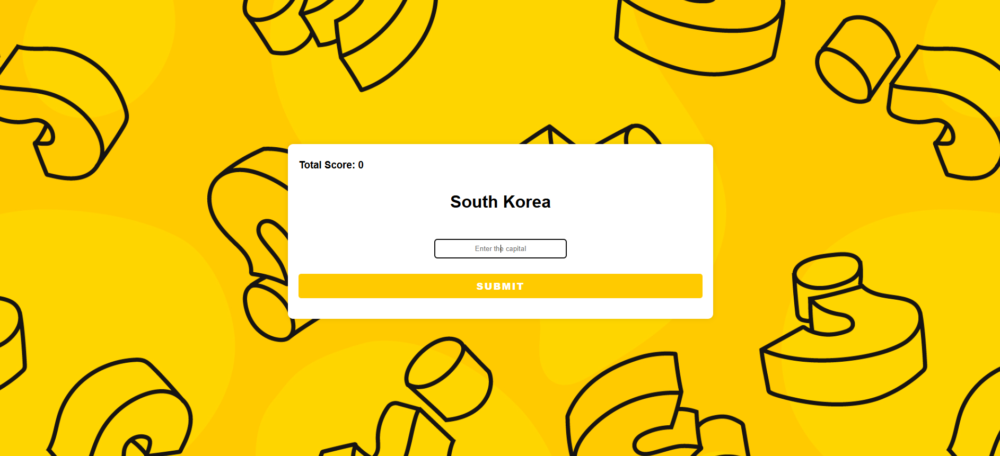

# Capital Quizz

[]()

A web quiz game to test your knowledge of world capitals. The app fetches country/capital pairs from a PostgreSQL database or from the `capitals.csv` file in the main folder, and lets you guess the capital for a random country. Your score is tracked for the session.

## ✨ Features

- **Random Questions:** Get a new random country each round.
- **Score Tracking:** See your total correct answers for the session.
- **PostgreSQL Integration:** Questions are loaded from a database.
- **Responsive Design:** Works on desktop and mobile.
- **Instant Feedback:** Know immediately if your answer was correct.

## 🛠️ Technologies Used

- **Backend:**
  - Node.js
  - Express
  - body-parser
  - pg (PostgreSQL client)
- **Frontend:**
  - EJS (templates)
  - HTML/CSS
- **Other:**
  - Git for version control

## Installation

1. **Clone the repository:**

   ```bash
   git clone https://github.com/Antoinekoe/capital-quizz.git
   cd capital-quizz
   ```

2. **Install dependencies:**

   ```bash
   npm install
   ```

3. **Set up your PostgreSQL database:**

   - Create a database named `world`.
   - Create a table named `capitals` with at least the columns `country` (text) and `capital` (text).
   - Fill it with `capitals.csv`

4. **Configure your PostgreSQL password:**

   - In `index.js`, replace the value of `password` in the `pg.Client` config with your own PostgreSQL password:
     ```js
     password: "YOUR_PASSWORD_HERE";
     ```

5. **Start the server:**

   ```bash
   nodemon index.js
   ```

   The app will be available at `http://localhost:3000`.

## 🗂️ Project Structure

```
Capital Quizz/
├── public/                # Static files (CSS, images, etc.)
├── views/                 # EJS templates
├── capitals.csv           # CSV file with country/capital data
├── index.js               # Main server file
├── package.json           # npm config file
├── package-lock.json      # npm lock file
├── LICENSE                # License file
├── screenshot-git.PNG     # Project screenshot
└── README.md              # This file
```

## 🤝 How to Contribute

Contributions are welcome!

1. **Fork the repository.**
2. **Create a branch for your feature or fix:**
   ```bash
   git checkout -b feature/my-new-feature
   # or
   git checkout -b bugfix/bug-fix
   ```
3. **Make your changes and commit with a clear message.**
4. **Push your branch to your fork:**
   ```bash
   git push origin feature/my-new-feature
   ```
5. **Create a pull request to the `main` branch of the original repository.**

## 🔧 Potential Improvements (TODO)

- Add difficulty levels.
- Add a timer for each question.
- Show a leaderboard.
- Add support for more languages.
- Improve accessibility and mobile experience.

## 🔑 License

This project is licensed under the MIT License - see the [LICENSE](LICENSE) file for details.
